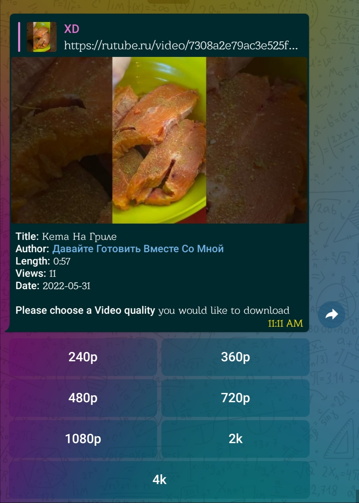
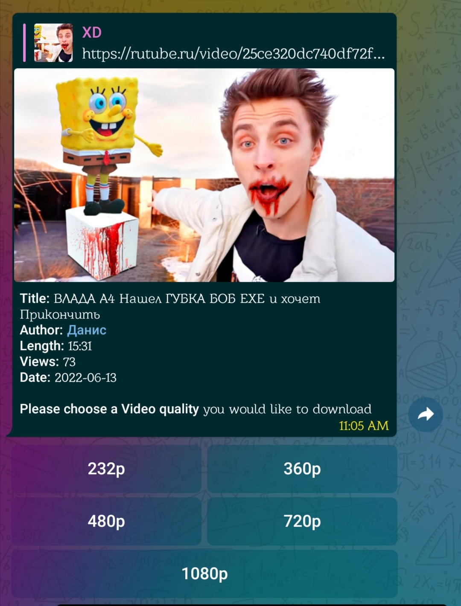

# Rutube_XD

Features :] :
 - Amazing download speeds
 - Up to 4k resolutions supported
 - Optimized for low resources
 - No useless code laying around (looking at you youtubedl)
 - Minimal libs required
 - Easy to Setup/Deploy
 - very low hardware/network usage
 - Supports Heroku/railway/local deploys
 - Completely safe no third-party libs used
   all data collected is safe (check requr.txt) 

enjoy :)

# Setup

### Railway
it's easier to deploy on railway, it has free builtin redis db, 
and a deploy template everything is set up for you.
  - Click railway button
  - put your token/env in variables
  - enjoy!

### Heroku
  - click the heroku deploy button
  - make a new bot with bot father on telegram copy token
  - paste your token and other env, then deploy
  - enjoy!

### Local deploy
  - clone this repo
    `git clone https://github.com/Justxd22/moneroo_xd && cd moneroo_xd/`
  - install requirements with pip
    `pip install ./requirements.txt`
  - fill in stuff.py with your env
  - run bot.py
    `python3 bot.py`
  - enjoy!! :]

# Credits

[@pyrogram](https://github.com/pyrogram/pyrogram) - telegram bot api

pm on telegram for any queries [@Pine_Orange](t.me/Pine_Orange) or [@xd2222](t.me/xd2222)

# Donations
You can support my work by donating to the following address,
THANKS KIND FRIEND!
  - XMR - `433CbZXrdTBQzESkZReqQp1TKmj7MfUBXbc8FkG1jpVTBFxY9MCk1RXPWSG6CnCbqW7eiMTEGFgbHXj3rx3PxZadPgFD3DX`
